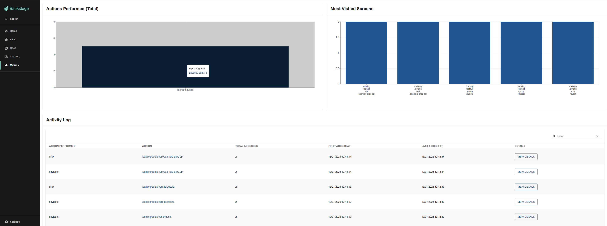
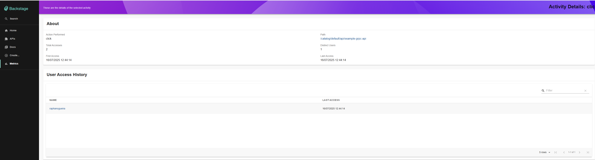

# Plugin Analytics Interno para Backstage

Após implementarmos o Backstage em nosso ambiente corporativo, sentimos a necessidade de obter métricas de uso: saber se a equipe estava acessando as documentações e quais eram as mais populares. Com isso em mente, criamos este plugin para gerenciar essas informações sem a necessidade de enviar dados para provedores externos.

O plugin depende apenas do próprio Backstage, gerando seu frontend, backend e módulos necessários. A única dependência externa é um banco de dados PostgreSQL, que já é um requisito do Backstage desde sua configuração inicial.

Abaixo seguem informações de configuração, instalação e exemplos visuais.

---

Este é o plugin Analytics Interno para o Backstage.io.

Este plugin fornece insights sobre a atividade dos usuários dentro da sua instância do Backstage.io, de forma nativa e sem a necessidade de ferramentas de análise externas. Ele também oferece a flexibilidade de encaminhar esses eventos para outras plataformas, se necessário.

Você pode obter as seguintes informações:
- Visualizações de tela
- Ações realizadas pelos usuários
- Contagem de acessos por item
- Registros de data e hora (timestamps) do primeiro e último acesso
- Uma visão detalhada para cada item, permitindo identificar quais usuários o acessaram.

# Backend do Analytics Interno

Para instruções de instalação e mais detalhes sobre como este pacote funciona, [consulte o README do backend](https://github.com/raphanogueira/backstage-plugins/blob/master/plugins/analytics-internal/backend/README.md).

**Nota Importante**: Este pacote opera de forma independente e é desacoplado de outros pacotes de analytics.

# Frontend do Analytics Interno

Para instruções de instalação e mais detalhes sobre como este pacote funciona, [consulte o README do frontend](https://github.com/raphanogueira/backstage-plugins/blob/master/plugins/analytics-internal/frontend/README.md).

**Nota Importante**: Este pacote é fortemente acoplado ao pacote `plugin-analytics-internal-backend` e depende dele para funcionar.

# Módulo do Analytics Interno

Para instruções de instalação e mais detalhes sobre como este pacote funciona, [consulte o README do módulo](https://github.com/raphanogueira/backstage-plugins/blob/master/plugins/analytics-internal/module/README.md).

**Nota Importante**: Este pacote é fortemente acoplado ao `plugin-analytics-internal-backend`. Uma configuração incorreta pode levar a erros, pois ele foi projetado para consumir dados do plugin de backend.