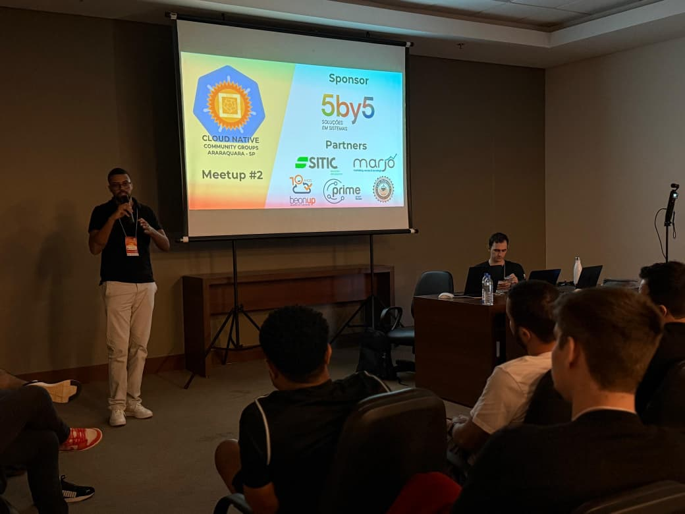

Como podemos capacitar nossos times de desenvolvimento para que entreguem valor com mais velocidade e segurança? Essa foi a pergunta central da minha palestra no **2º Meetup da [Cloud Native Araraquara-SP](https://www.linkedin.com/company/cncfararaquara)**, que aconteceu no último dia 19 de abril.

Foi uma honra imensa aceitar o convite do [**Matheus Ulisses**](https://www.linkedin.com/in/matheus-ulisses) para compartilhar minha experiência com a comunidade. Durante o evento, demonstrei como a adoção de um **Golden Path com a plataforma [Backstage.io](https://backstage.io/)** tem sido um divisor de águas para otimizar a jornada de engenharia.

Abordei como essa estratégia resolve desafios críticos, permitindo:

* **Acelerar o Time-to-Market:** Reduzir o tempo de setup de novos serviços de dias para minutos, automatizando a criação de toda a infraestrutura e pipeline de CI/CD necessários.
* **Fortalecer a Governança:** Incorporar as melhores práticas de segurança, qualidade e conformidade desde a primeira linha de código, de forma padronizada para toda a organização.
* **Potencializar a Inovação:** Melhorar drasticamente a Developer Experience (DevX), abstraindo complexidades e permitindo que os desenvolvedores foquem na lógica de negócio e na criação de soluções de impacto.

Agradeço a todos que participaram e contribuíram com perguntas excelentes. Quero deixar um agradecimento muito especial à minha noiva, [Gabrielle Limoni](), por ser meu grande apoio de sempre. A energia da comunidade de Araraquara é contagiante! Parabenizo também os organizadores por um evento de altíssimo nível.

E na sua empresa, como vocês lidam com a padronização e o onboarding de novos projetos? Vamos conversar nos comentários!

## Evento

